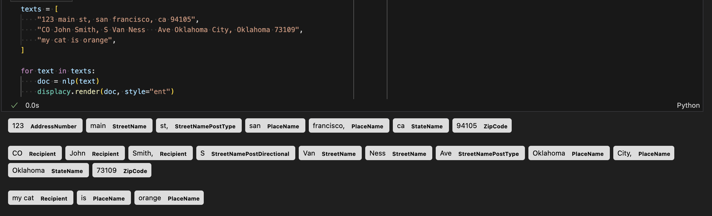

# spacy-address

Use [spaCy](https://spacy.io/)'s NER pipeline to parse oneline US addresses

Uses the the labeled data from [usaddress](https://github.com/datamade/usaddress)
with spaCy's very easy [training infrastructure](https://spacy.io/usage/training)

Still a work in progress. I've gotten `python -m spacy train` to run, and results
look promising!



## Install

I will try to improve the package name a bit, but here is something that currently works:

```bash
python -m pip install "en-pipeline @ https://github.com/NickCrews/spacy-address/releases/download/20241006-213351/en_pipeline-0.0.0-py3-none-any.whl"
```

Now, this is accessible from python:

```python
import spacy

nlp = spacy.load("en_pipeline")
doc = nlp("123 E Elm st S,   Oklahoma City, OK 99507-1234")
for ent in doc.ents:
    print(ent.text, ent.label_)
# 123 AddressNumber
# E StreetNamePreDirectional
# Elm StreetName
# st StreetNamePostType
# S, StreetNamePostDirectional
# Oklahoma PlaceName             # nice, this is recognized as a place, not a state!
# City, PlaceName
# OK StateName
# 99507-1234 ZipCode
```

## Future Work

- Currently the pipeline is based on the `en_core_web_lg` model. I want to make variations
  that are based on the `en_core_web_sm` for faster inference, and the `en_core_web_trf`
  for best performance
- Currently, every token is parsed as a different entity. eg "Oklahoma City" is
  really one entity, but it is getting parsed as two different ones.
  This is mostly a limitation of the data I used for training, which is
  on the per-token level and deosn't describe how tokens should be merged together,
  but I think with some preprocessing it should be fixable.
- Improve the metadata that is included in the released packages.
  Something to do with the `meta.json` file that is used in the `spacy package` command?

## Licence

Released under the MIT license.